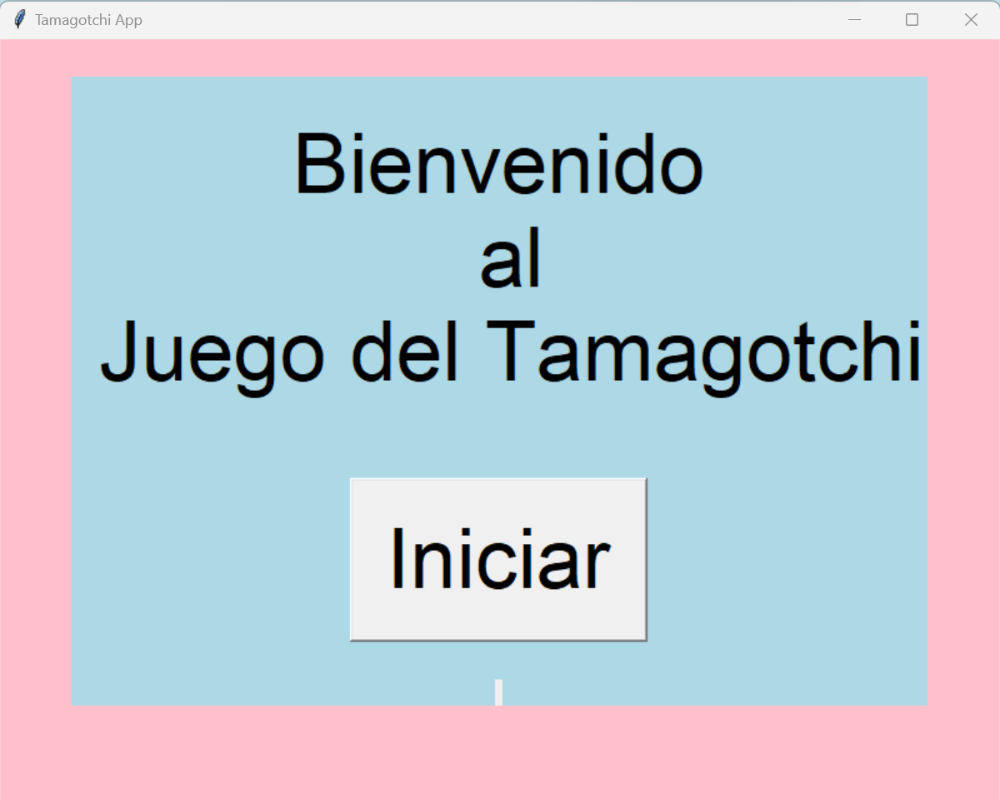
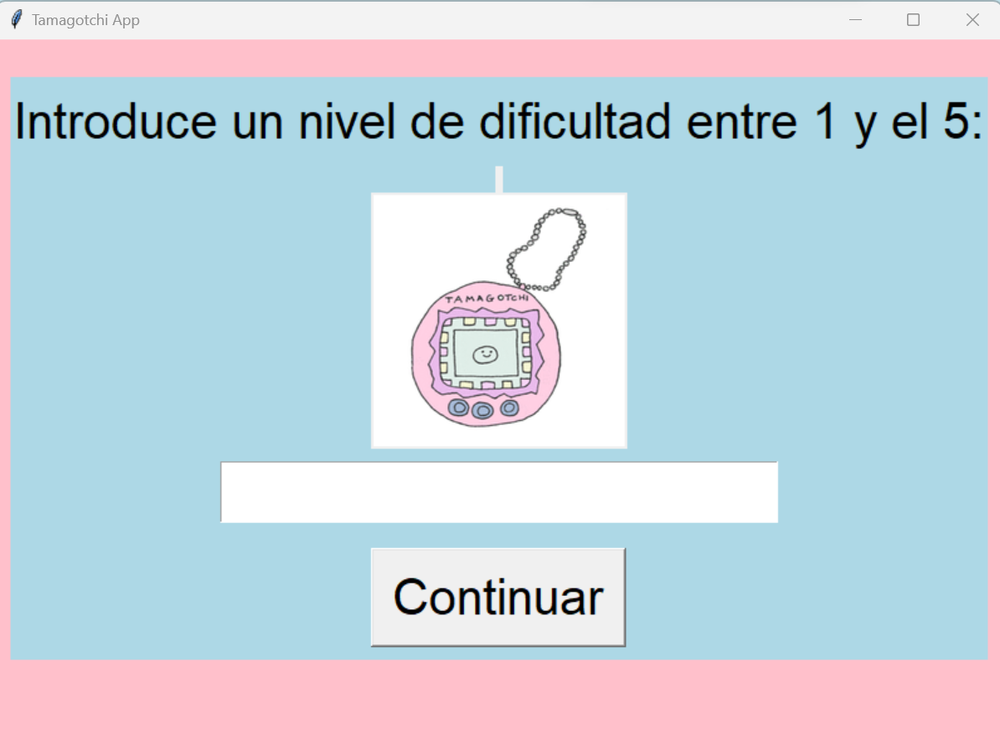
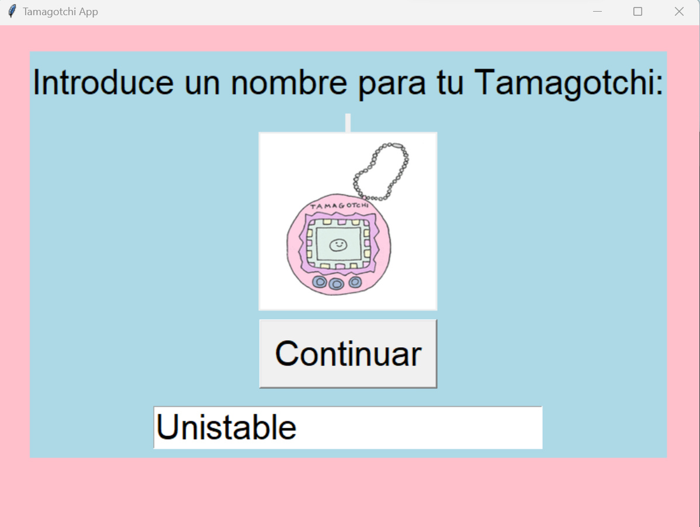
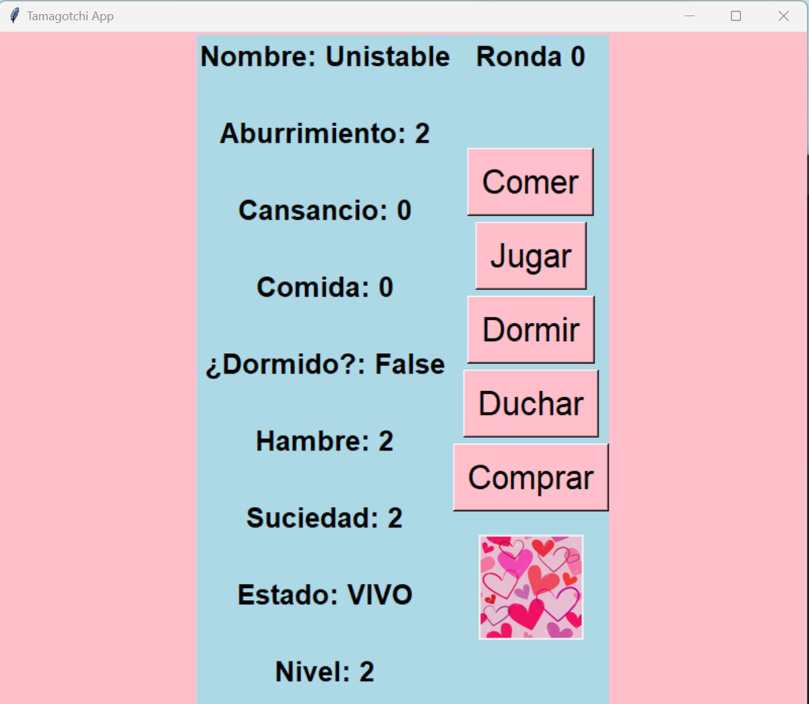
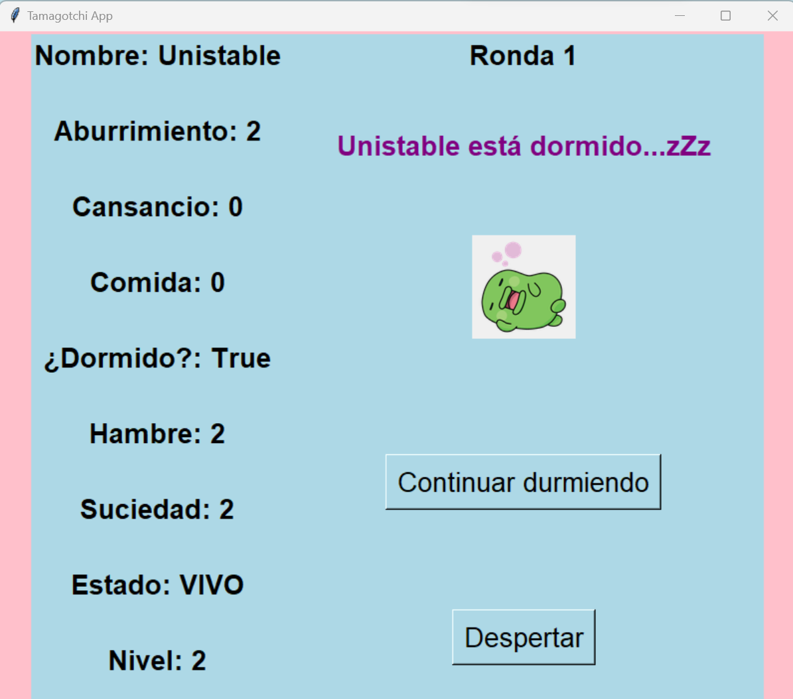

# tamagotchi_app
# Tamagotchi App en Python

En este ejercicio vamos a intentar replicar el popular juego de tamagotchi de los 90's con python, usando clases y métodos.

El programa le permitirá al usuario crear su propio tamagotchi, darle un nombre y cuidarlo hasta que el tamagotchi deje de existir. El usuario monitoreará el hambre, el aburrimiento, el cansancio y la suciedad de la criatura y deberá tomar acciones para que niguna de estas categorias sea muy alta, si alguna de estas categorias llegan a su limite entonces el tamagotchi morirá.

### Codigo Principal

1. Imprime un mensaje con el nombre del proyecto y otro que describa el proyecto.

========================================================================================================================

2. Pide al usuario el nivel de dificultad, este debe ser un número entre 1 y 5, guarda este número como entero en la variable **`nivel_dificultad`**.

========================================================================================================================

3. Pide al usuario el nombre del **`Tamagotchi`** y guarda este string en la variable **`nombre_tamagotchi`**.

========================================================================================================================

4. Inicializa un objeto de clase **`Tamagotchi`** usando el nombre **`nombre_tamagotchi`** y asigna esta instancia a la variable **`mi_tamagotchi`**.

========================================================================================================================

5. Inicializa una variable **`ronda`** e igualala a 1.

========================================================================================================================

6. Crea un bucle **`while`** que se ejecute mientras la criatura este con vida:
    - Imprima: **Esta es la ronda numero `ronda`**.
    - Llame al método **`mostrar_valores()`** de la criatura.
    - LLame la función **`mostrar_menu()`**.
    - LLama la función **`llamar_accion()`**.
    
    - Imprima: **Ronda nº: `ronda`**
    - Llama el método **`mostrar_valores()`** de la criatura.
    - Haz que la celda se detenga por 3 segundos.
    
    - Llama el método **`dificultad()`** de la criatura.
    - LLama el método **`morir()`** de la criatura.
    - Incrementa en 1 la variable **`ronda`**.
    
========================================================================================================================

7. Si la criatura muere que imprima el mensaje: **`nombre` ha fallecido :(**

========================================================================================================================

8. Imprima el número de rondas que se jugaron.
